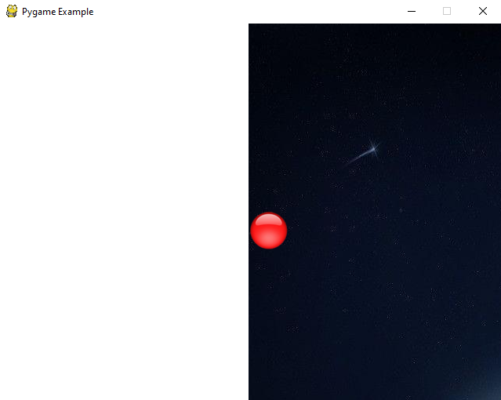
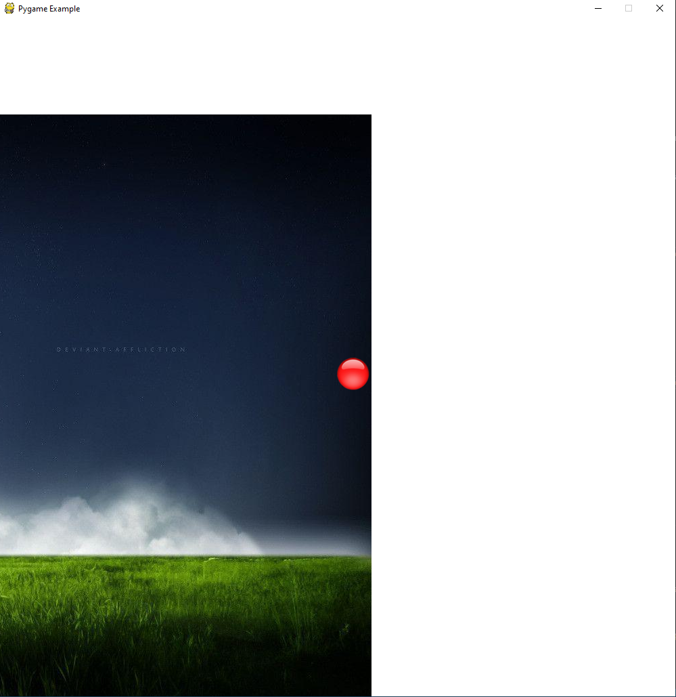
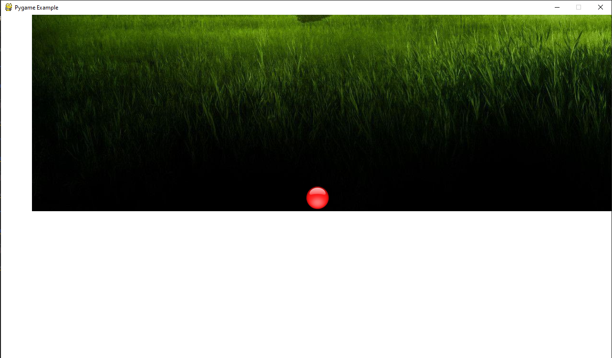
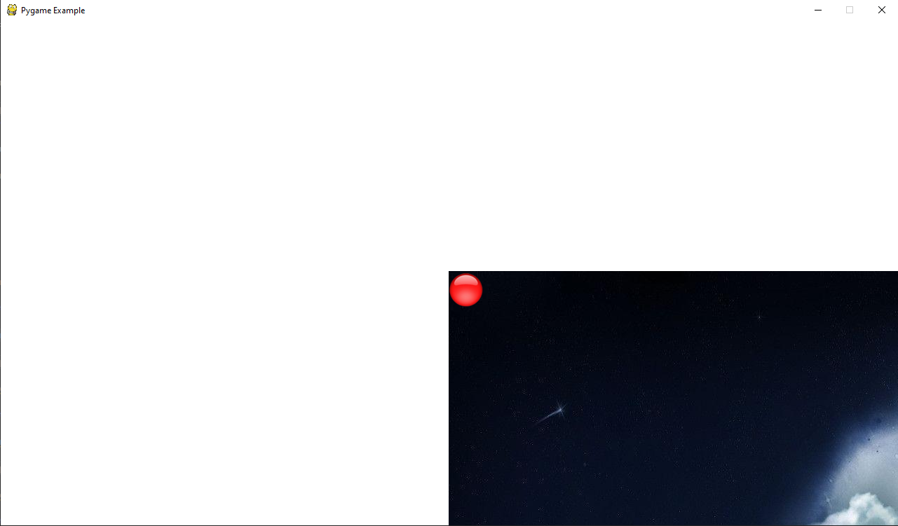

# P01.2 - CovidZAR.EIEIO

## Corbin Matamoros

## Assignment Description

### This program uses the pygame library to move a sprite (textured/colored circle) around a game world while staying centered in the window. The sprite is not allowed to travel off the world (represented by the background image), which is surrounded by white

## Folder Structure

|   #   | File | Assignment Description |
| :---: | ----------- | ---------------------- |
|   1    |  [game_pt2.py](game_pt2.py)  | main driver code that lauches Pygame application |
|   2    |  [helper_module.py](helper_module.py)  | helper code written by Dr. Griffin |
|   3    |  [color_list.txt](color_list.txt)  | list of available window background colors |
|   4    |  [grab_colors.py](grab_colors.py)  | mini program written by Corbin that prints all color options to the `color_list.txt` |
|   5    |  [colors.json](colors.json)  | `.json` file of names of colors and their RGB/Hex values |
|   6    |  [ball_48x48.png](ball_48x48.png)  | image used to represent the player in the Pygame application |
|   7    |  [background.jpg](background.jpg)  | image used to represent the world in which the player resides |
|   8    |  [screenshot1.png](screenshot1.png)  | image showing player on left side of screen |
|   9    |  [screenshot2.png](screenshot2.png)  | image showing player on right side of screen |
|   10    |  [screenshot3.png](screenshot3.png)  | image showing player at bottom of screen |
|   11    |  [screenshot4.png](screenshot3.png)  | image showing player at top left corner of screen |

## Instructions

1. Ensure the latest version of Python is installed on your system. This code was originally run with Python 3.8.3

2. Follow the instructions on the [pygame wiki](https://www.pygame.org/wiki/GettingStarted) to get it installed.

3. Open a command prompt / terminal in the `P01.2` folder

4. Run `game_pt2.py` by typing `python game_pt2.py title= width= height= startx= starty= fps= player_image= color= background_image=`. Select for yourself the window title (`title`), dimensions in pixels (`width` and `height`), the starting location of your character (`startx` and `starty`), refresh rate (`fps`), your character's image (`player_image`), screen background color (`color`), and the background image (`background_image`). Select the color from [color_list.txt](color_list.txt).

5. To move your player, keep your mouse over the window and move it around (clicking won't do anything). If the mouse leaves the window, the player will stop moving.

6. Close the window to exit the game

## Example

The following is an example of the Pygame app if run with this command: `python game_pt2.py title="Pygame Example" width=1280 height=720 startx=320 starty=240 fps=60 player_image="./ball_48x48.png" color=black background_image="./background.jpg"`

### Gif

### Screenshot 1

`python game_pt2.py title="Pygame Example" width=640 height=480 startx=320 starty=240 fps=60 player_image="./ball_48x48.png" color=black background_image="./background.jpg"`

### Screenshot 2

`python game_pt2.py title="Pygame Example" width=1000 height=1000 startx=320 starty=240 fps=60 player_image="./ball_48x48.png" color=black background_image="./background.jpg"`

### Screenshot 3

`python game_pt2.py title="Pygame Example" width=1280 height=720 startx=320 starty=240 fps=60 player_image="./ball_48x48.png" color=black background_image="./background.jpg"`

### Screenshot 4

`python game_pt2.py title="Pygame Example" width=1280 height=720 startx=320 starty=240 fps=60 player_image="./ball_48x48.png" color=black background_image="./background.jpg"`

